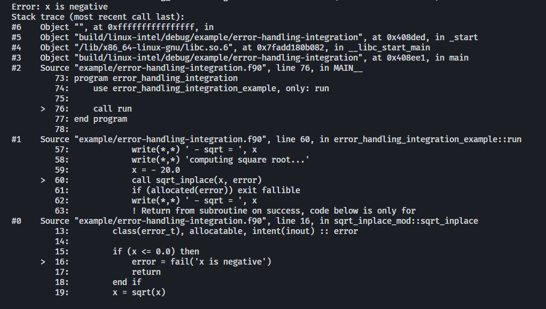

= Fortran Error Handling
:imagesdir: doc/

Fortran does not have any built-in mechanisms for errors as seen in most
other programming languages.
Over the years, developers often have resorted to integer or logical arguments
as error flags and manual labelling of error returns to be able to determine the
source of the error.
This process is time consuming and mistakes lead to inaccurate information and
annoyance while debugging.

The fortran error-handling library makes this process much easier by providing a type,
`error_t`, to indicate if a procedure invocation has failed.
Errors can be handled gracefully and context can be added while returning up
the call stack.
It is also possible to programmatically identify and handle certain types or errors
without terminating the application.

//TODO: URL
But perhaps most interesting is the ability to generate stacktraces along with any
error when combined with the http://TODO:[fortran-stacktrace] library.
This means that you can easily make even old legacy code output errors messages like this:



The source code snippets are of course voluntary and only available on a machine
with access to the source code itself.


[#quickstart]
== Quick Start

All functionality is located in the link:src/error_handling.f90[`error_handling`] module.
When writing a subroutine that might fail, add an `type(error_t), allocatable` argument,
for example:

[source,fortran]
----
include::../example/basic.f90[tag=usage]
----

NOTE: If the subroutine is pure or elemental the intent must be `intent(inout)` in order
to be standard compliant, otherwise `intent(out)` may be used.

Then use your newly created routines:

[source,fortran,indent=0]
----
include::../example/basic.f90[tag=run]
----

=== Generating Stacktraces
// TODO: URL
For enabling stacktraces from errors, see instructions http://TODO:[here].

== Building

A fairly recent Fortran and compiler is required to build this library.
The following compilers are known to work:

- gfortran version 9 or later
- Intel Fortran 2021 or later

=== CMake

The recommended way of getting the source code for this library when using CMake
is to add it as a dependency using
https://github.com/cpm-cmake/CPM.cmake/[CMake Package Manager (CPM)]:

[source,cmake]
----
CPMAddPackage("https://github.com/SINTEF/fortran-error-handling.git@0.1.0")
target_link_libraries(<your target> fortran-error-handling)
----

//TODO:

// === CMake With Declarative CMake Template

// //TODO: link
// If you're using http://todo[Declarative CMake Template] as a template for your CMake
// projects, simply add `error-handling` to your dependencies list:
// //TODO: Update link
// [source,json]
// ----
// "dependencies": {
//     "error-handling": {"git": "https://github.com/SINTEF/fortran-error-handling.git", "version": "0.1.0"},
// },
// ----


=== CMake Without CPM

If you don't want to use CPM you can either use
https://cmake.org/cmake/help/latest/module/FetchContent.html[FetchContent]
manually or add this repo as a git submodule to your project. Then in your
`CMakeLists.txt` add it as a subdirectory and use `target_link_libraries` to
link against `error-handling`.

=== Fortran Package Manager (FPM)

In your Fortran Package Manager `fpm.toml` configuration file, add this repo as a dependency:

```toml
[dependencies]
error-handling = { git = "https://github.com/SINTEF/fortran-error-handling.git", tag = "v0.5.0" }
```

== API Reference

All functionality in this library can be accessed from the module `error_handling`.
The modules directly under the `src/` folder contains specification and documentation
of the different types and their procedures:

* For type `error_t`, see link:src/error_handling_error.f90[]
* For class `fail_reason_t`, see link:src/error_handling_fail_reason.f90[]
* For types `error_hookt_t` and `error_handler_t`, see link:src/error_handling_hook.f90[]
* For subroutine `error_stop`, see link:src/error_handling_error_stop.f90[]


== Usage

After trying out the <<quickstart>>, see the sections below for some more advanced
features in this library.

=== Error Contextual Information

For the developer a stacktrace is an invaluable resource for determining the reason
of an error.
For users however, the stacktrace is hardly of any use at all.
This is why it is important to gracefully unwind the application and provide some
information about what caused the error so that users may take action themselves.

The example below shows how the subroutine `with_cause` can be used to provide
contextual information in the event of an error.
In fact this information will be very useful for a developer as well since the stacktrace
from a successful invocation of `add_bounded` looks exactly the same as the one that fails.


[source,fortran]
----
include::../example/adding-context.f90[]
----

This will produce the output shown in the screenshot on the top of this page.

=== Pure Functions

Pure and elemental subroutines can have multiple arguments with `intent(inout)`
or `intent(out)`.
This makes it possible to modify one or more arguments and have an additional
`error_t` argument for communicating if any error has ocurred.

Pure and elemental functions on the other hand are only allowed to modify their
return value which means that one cannot add an `error_t` argument with
`intent(inout)` to indicate failures.

One way of dealing with this is to return a type which can either hold the result
ing data or an `error_t`, for example:

[source,fortran]
----
type :: result_int_t
    integer, allocatable :: value
    type(error_t), allocatable :: error
end type
----

WARNING: Technically, this type can also hold a value AND an error.
    The programmer must make sure that this does not happen.

This idea is very similar to the
https://doc.rust-lang.org/book/ch09-02-recoverable-errors-with-result.html[Result]
enum in the Rust programming language.
Since Fortran neither have https://github.com/j3-fortran/generics/issues/9[generics]
nor any support for https://en.wikipedia.org/wiki/Tagged_union[sum data types]
(enums) this is quite a bit more cumbersome to set up in Fortran.
The module link:src/experimental/result.f90[`error_handling_experimental_result`]
provide such result types for some primitive data types. Example:

[source,fortran]
----
use iso_fortran_env, only: dp => real64
use error_handling_experimental_result, only: result_real_dp_rank1_t
use error_handling, only: error_t

! (...)

type(result_real_dp_rank1_t) pure function func(x) result(y)
    real(dp), intent(in)  :: x

    if (x >= 0) then
        y = x * [1.0, 2.0, 3.0]
    else
        y = error_t('x must be positive')
    end if
end function
----

To use the function:

[source,fortran]
----
type(result_real_dp_rank1_t) :: y

y = func(-12.0_dp)
if (y%is_error()) then
    ! Handle error here
else
    ! y%value is safe to use here
end if
----

WARNING: There seems to be a bug in gfortran with finalization when a types
    assignment operator is overloaded like we do here.
    If you use or plan to support gfortran you currently need to assign
    errors like this: `y%error = error_t('...')` or your program will crash!

WARNING: This is currently an experimental feature. Expect breaking changes in the
    future.

=== Programmatically Handling Specific Errors

In some situations it might be desirable to detect and handle specific error conditions,
for example in order to continue execution.
If you're developing a library for others to use it is good practice to do so
as you don't know how users may wish to use your library.

The `error_t` type can be constructed with a custom type extending
`fail_reason_t`. This can later be detected with a `select type` block:

[source,fortran]
----
type(error_t), allocatable :: error
! (...)
select type (reason => error%root_cause)
    type is (special_fail_reason_t)
        ! Add code here to gracefully handle an failure reason of type special_fail_reason_t
end select
----

For a complete example, see link:example/fail-reason.f90[`fail-reason.f90`].

== Design

The design of this library is heavily inspired by error handling mechanisms in
the https://doc.rust-lang.org/book/ch09-00-error-handling.html[Rust programming language]
and specifically the Rust library https://docs.rs/eyre/latest/eyre/[eyre].
Rust don't use exceptions like many other popular programming languages.
Interestingly this means that error handling in Fortran - one of the oldest
programming languages still actively used - share certain patterns with one of the
more "modern" programming languages around.

The vast majority of all source code includes error scenarios of some sorts.
Fundamentally, a good method for handling errors in Fortran should satisfy the
following requirements:

* Usable both in pure and impure subroutines and functions.
* Low overhead, especially for successful calls.
* Errors should be difficult to overlook. It should be obvious for the developer that they need to check if something went wrong.
* It should be possible to provide accurate information about what failed and when it occurred.
* Some errors might need to be recoverable, i.e. the _caller_ of a procedure should be able
  to programmatically detect and act if a certain error occurred.

There are many ways of designing a error handling system for Fortran.
This library satisfies the above requirements and should be reasonably easy to use.
Some design decisions in might however not be obvious at first glance,
but are done so for good reasons:

Why is a second library required for stacktrace generation?::

The stacktrace generation code requires some additional dependencies, namely a
C++ compiler, some Win32 API calls on Windows and libbfd on Linux.
By keeping this library pure Fortran with no additional dependencies it is very easy
to use it for error handling in other libraries.
This means that you (as the library developer) don't impose additional dependencies
to your users that they might not want to use.
Stacktrace generation may be desirable in a standalone application, but if the Fortran
code is to be embedded in for example a Python library this might not be desirable.
The separation means that this library and libraries depending on it will be relevant
in both scenarios.

Why isn't `error_t` itself abstract, instead of `fail_reason_t`?::

One could imagine that subroutines could take a `class(my_error_t), allocatable`
where `my_error_t` extends `error_t` to enable checking for specific errors.
While testing this approach I encountered way too may compiler bugs
to bother carrying on with it.
Also, the Fortran standard unfortunately makes using such a design very clumsy.
See https://github.com/j3-fortran/fortran_proposals/issues/242[this proposal] for
further details.


== License and Copyright

Copyright 2022 SINTEF Ocean AS. All Rights Reserved. MIT License.